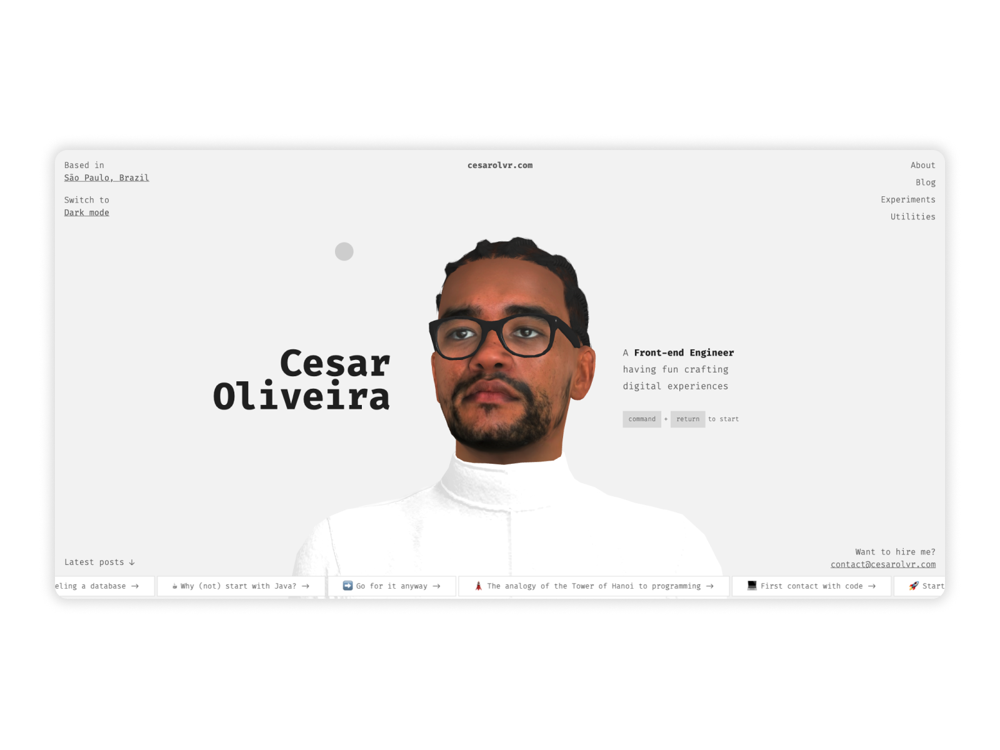

# Cesarolvr's Personal Website



A modern, responsive personal website built with Gatsby.js, featuring a sleek design and interactive elements.

## 🚀 Features

- Modern and responsive design
- Built with Gatsby.js for optimal performance
- Interactive 3D elements using Three.js
- Syntax highlighting for code snippets
- Google Analytics integration
- SEO optimized with sitemap generation
- Tailwind CSS for styling
- SASS support for custom styling

## 🛠️ Tech Stack

- [Gatsby.js](https://www.gatsbyjs.com/) - React-based static site generator
- [React](https://reactjs.org/) - JavaScript library for building user interfaces
- [Three.js](https://threejs.org/) - 3D graphics library
- [Tailwind CSS](https://tailwindcss.com/) - Utility-first CSS framework
- [SASS](https://sass-lang.com/) - CSS preprocessor
- [React Syntax Highlighter](https://github.com/react-syntax-highlighter/react-syntax-highlighter) - Code syntax highlighting

## 🏗️ Getting Started

### Prerequisites

- Node.js (v14 or later)
- Yarn or npm package manager

### Installation

1. Clone the repository:
   ```bash
   git clone https://github.com/cesarolvr/cesarolvr-www.git
   cd cesarolvr-www
   ```

2. Install dependencies:
   ```bash
   yarn install
   # or
   npm install
   ```

3. Start the development server:
   ```bash
   yarn dev
   # or
   npm run dev
   ```

The site will be available at `http://localhost:8000`

## 📝 Available Scripts

- `yarn dev` or `npm run dev` - Start development server
- `yarn build` or `npm run build` - Build for production
- `yarn serve` or `npm run serve` - Serve production build
- `yarn clean` or `npm run clean` - Clean Gatsby cache

## 🔧 Configuration

The project uses several Gatsby plugins and configurations:

- `gatsby-plugin-google-gtag` - Google Analytics integration
- `gatsby-plugin-image` - Image optimization
- `gatsby-plugin-manifest` - PWA support
- `gatsby-plugin-sitemap` - SEO optimization
- `gatsby-plugin-postcss` - PostCSS support
- `gatsby-plugin-sass` - SASS support

## 📄 License

This project is licensed under the MIT License - see the [LICENSE](LICENSE) file for details.

## 👤 Author

Cesarolvr
